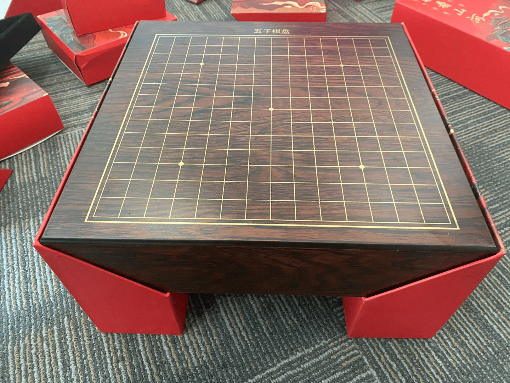
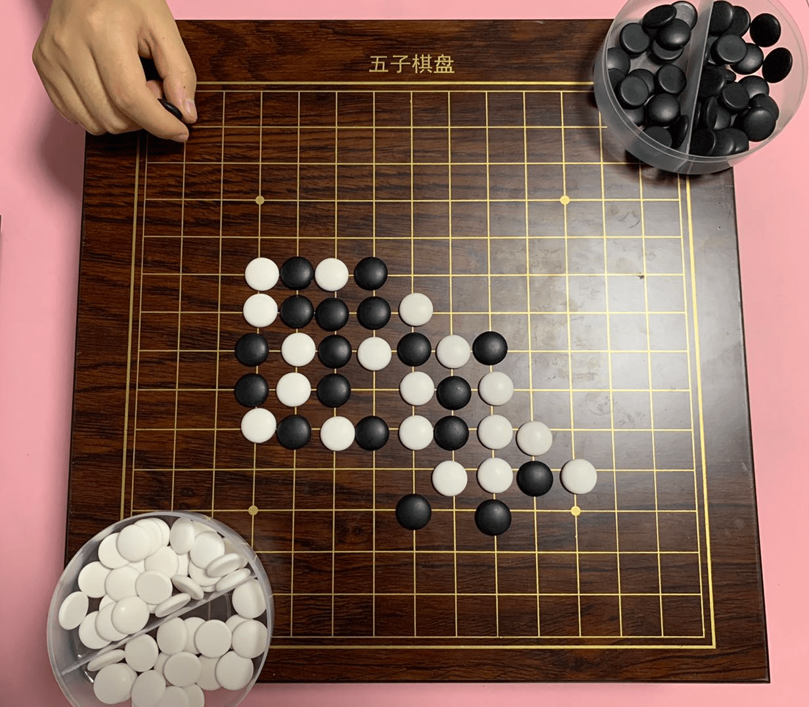

# 基于 Blazor 开发五子棋小游戏

**今天是农历五月初五，端午节。在此，祝大家端午安康！**

> 端午节是中华民族古老的传统节日之一。端午也称端五，端阳。此外，端午节还有许多别称，如：午日节、重五节、五月节、浴兰节、女儿节、天中节、地腊、诗人节、龙日等。

不好意思，跑题了，就此打住。

事情的经过是这样的，今年端午节公司给每位员工都准备了一个粽子礼盒，本以来就几个粽子而已，没想到今年的粽子礼盒内暗藏玄关，内附一个棋盘和五子棋子。




粽子什么的都不重要，主要是这个五子棋我还挺喜欢的，哈哈哈。😎

正好这段时间用 Blazor 将之前的博客重构了一遍，于是就想着能否用 Blazor 写一个五子棋⚫⚪小游戏呢？

说干就干，本篇主要是分享基于 Blazor 开发的五子棋小游戏，先放试玩地址：<https://blazor.meowv.com/gobang> 。

大家可以先打开链接让他先加载一会(挂在GitHub，有点慢~🤪)，再继续回来看文章哈。


刚开始本来我是自己写的，发现越写越复杂，遂放弃就在Github上寻找有没有实现过类似的需求，别说还真有一位大神用 Blazor 实现了，地址：<https://github.com/ut32/gobang/> ，所以我的代码逻辑基本上都参考这位大神的代码。👍👍👍

接下来看看实现过程，新建一个`Gobang.razor`razor组件，设置路由：`@page "/gobang"`。

我这里直接放在之前 Blazor 实战系列的项目中，如果你没有看过我的 Blazor 实战系列文章，建议你快去刷一遍。😁

相信五子棋大家都玩过，规则我就不说了。

先理一下需求和实现步骤：

1. 在页面上显示一个 19x19 的棋盘。
2. 给两个选项，电脑先手还是我先手。
3. 开始游戏按钮，结束游戏按钮，一个按钮，文字动态显示。
4. 落子问题，黑子始终先手，黑白交替落子，已经落子的地方不允许继续落子。
5. 黑白棋子落子的样式问题。
6. 人机对战，电脑如何最佳选择位置进行落子。
7. 如何判断输赢，四个方向：横竖撇捺。
8. 实现一个简单的五子棋小游戏，不考虑放弃落子、禁手等问题。

先渲染一个 19x19 的棋盘，直接两层 for 循环配合 CSS 搞定。

```html
<div class="gobang-box">
    <div class="chess">
        @for (var i = 0; i < 19; i++)
        {
            @for (var j = 0; j < 19; j++)
            {
                var _i = i;
                var _j = j;
                <div class="cell" @onclick="@(async () => await Playing(_i, _j))">
                    <span class="chess@(Chess[i, j])"></span>
                </div>
            }
        }
    </div>
</div>
```

其中的`onclick`方法先不看，主要是我方落子的点击事件。

`Chess`是定义的一个二维数组：`private int[,] Chess = new int[19, 19];`。

最重要的棋子就是`span`标签，用class来控制黑白，当`class = "chess1"`为黑子，当`class = "chess2"`为白子。

同时在棋盘旁边添加一些按钮，选择谁先手的选项和描述信息。

```html
<div class="chess-info">
    <h1>五子棋⚫⚪</h1>
    <p><b>⚡是时候表演真正的技术了，快来一场人机大战吧⚡</b></p>
    <p><label><input type="radio" name="chess" checked="checked" @onclick="@(() => first = "ai")"> 电脑先手</label></p>
    <p><label><input type="radio" name="chess" @onclick="@(() => first = "me")"> 我先手</label></p>
    <p><button class="box-btn" @onclick="StartGame">@(IsInGame ? "结束游戏" : "开始游戏")</button></p>
    <div class="chess-msg">
        <p><b>@msgs</b></p>
        <p>游戏规则：</p>
        <span>（1）请选择电脑先手还是你先手，黑棋始终先手。</span>
        <span>（2）点击开始游戏按钮开始对局。</span>
        <span>（3）点击结束游戏按钮结束对局。</span>
        <span>（4）对局双方各执一色棋子。</span>
        <span>（5）空棋盘开局。</span>
        <span>（6）黑先、白后，交替下子，每次只能下一子。</span>
        <span>（7）棋子下在棋盘的空白点上，棋子下定后，不得向其它点移动，不得从棋盘上拿掉或拿起另落别处。</span>
        <span>（8）黑方的第一枚棋子可下在棋盘任意交叉点上。</span>
        <span>（9）轮流下子是双方的权利，<del>但允许任何一方放弃下子权（即：PASS权）</del>。</span>
        <span>（10）<del>五子棋对局，执行黑方指定开局、三手可交换、五手两打的规定。整个对局过程中黑方有禁手，白方无禁手。黑方禁手有三三禁手、四四禁手和长连禁手三种。</del></span>
    </div>
</div>
```

这里同时把用到的css样式给到大家。

```css
.gobang-box {
    width: 1200px;
    margin: 0 auto;
    -webkit-user-select: none;
    -moz-user-select: none;
    -ms-user-select: none;
    user-select: none;
}
.chess {
    width: 760px;
    height: 760px;
    float: left;
}
.chess .cell {
    float: left;
    width: 40px;
    height: 40px;
    position: relative;
    cursor: pointer;
    font-size: 10px;
    color: #ffd800;
}
.chess .cell::after {
    content:' ';
    position: absolute;
    height: 2px;
    display: block;
    width: 100%;
    border-bottom: #f5d099 1px solid;
    background: #c8a06f;
    top: 50%;
    left: 0;
    z-index: 2;
}
.chess .cell::before {
    content:' ';
    position: absolute;
    height: 100%;
    display: block;
    width: 2px;
    border-right: #f5d099 1px solid;
    background: #c8a06f;
    top: 0;
    left: 50%;
    z-index: 1;
}
.chess .cell .chess1 {
    display: block;
    width: 30px;
    height: 30px;
    border-radius: 15px;
    text-align: center;
    line-height: 54px;
    background: #000000;
    left: 5px;
    top: 5px;
    position: absolute;
    z-index: 10;
    background-image: radial-gradient(#444 5%, #111 15%, #000 60%);
    box-shadow: 0px 0px 3px #333;
}
.chess .cell .chess2 {
    display: block;
    width: 30px;
    height: 30px;
    border-radius: 15px;
    text-align: center;
    left: 5px;
    top: 5px;
    position: absolute;
    z-index: 10;
    line-height: 54px;
    background-image: radial-gradient(#ffffff 5%, #f1f1f1 15%, #f1f1f1 60%);
    box-shadow: 0px 0px 3px #333;
}
.chess-info {
    float: left;
    width: 400px;
    height: 760px;
    padding-left: 20px;
    margin-left: 40px;
}
.chess-info input {
    display: initial;
    width: initial;
    height: initial;
    visibility: initial;
}
.chess-msg {
    margin-top: 20px;
    color: #aaa;
}
.chess-msg span {
    display: block;
    font-size: 12px;
}
```

现在来把用到的一些变量和方法搞进来。

```csharp
private int[,] Chess = new int[19, 19];

private string first = "ai";

private bool IsInGame = false;

private string msgs;

private int AIChess = 1;

private int MineChess = 2;
```

`Chess`是棋盘的二维数组。

`first`为先手字段，默认电脑先手，我这里赋值为"ai"，用他来判断是我先手还是电脑先手。

`IsInGame`用来判断当前游戏状态，是否开始游戏，可以根据它来动态控制按钮文字内容。

`msgs`是一个提示信息，告诉玩家双方执子情况。

`AIChess = 1`和`MineChess = 2`就是黑白子，默认电脑为黑子，我为白子。

上方两个radio标签，用来选择谁先手，点击事件分别给`first`赋值，按钮点击事件`StartGame`。

```csharp
private void StartGame()
{
    // 初始化棋盘
    Chess = new int[19, 19];

    // 是否开始游戏，点击按钮重置显示消息
    if (IsInGame)
    {
        msgs = string.Empty;
    }
    else
    {
        // 电脑先手
        if (first == "ai")
        {
            AIChess = 1;
            MineChess = 2;

            // 电脑落子正中心天元位置
            Chess[9, 9] = AIChess;

            msgs = "电脑：执黑子 ⚫ 我：执白子 ⚪";
        }
        else
        {
            // 我先手的话则我执黑子，电脑执白子
            MineChess = 1;
            AIChess = 2;

            msgs = "我：执黑子 ⚫ 电脑：执白子 ⚪";
        }
    }

    // 改变游戏状态，用于显示不同文字的按钮
    IsInGame = !IsInGame;
}
```

开始游戏之前，先初始化一下棋盘，然后判断当前是否在游戏中，在游戏中点了按钮对应的肯定是结束游戏，那么此时将提示消息清空。如果未开始游戏，点了按钮就是开始对局了，此时就去判断电脑先手还是我先手。根据这两种情况分别给`AIChess`和`MineChess`赋值，给出对应的提示消息。如果是电脑先手，那么自动在棋盘正中心位置落子，查了一下这个位置叫天元。直接将棋盘数组赋值`Chess[9, 9] = AIChess;`即可，最后点了按钮是需要改变状态的：`IsInGame= !IsInGame;`。

那么如果是我先手或者电脑落子之后，此时需要我方落子，那么我方落子的方法就是`Playing(int row, int cell)`方法。

```csharp
private async Task Playing(int row, int cell)
{
    // 是否开始游戏，当前判断没开始给出提示
    if (!IsInGame)
    {
        await Common.InvokeAsync("alert", "\n💪点击开始游戏按钮开启对局，请阅读游戏规则💪");
        return;
    }

    // 已落子直接返回，不做任何操作
    if (Chess[row, cell] != 0)
        return;

    // 根据传进来的坐标进行我方落子
    Chess[row, cell] = MineChess;

    if (IsWin(MineChess, row, cell))
    {
        await Common.InvokeAsync("alert", "\n恭喜，你赢了👍");
        IsInGame = !IsInGame;
        return;
    }

    // 我方落子之后电脑落子
    await AIPlaying(AIChess);
}
```

我放落子之前先判断是否开始游戏，如果为点击开始游戏按钮，则给出弹窗提示，直接返回不做任何操作，接着有一种情况，我方点击了已经落子了的位置，也不做任何操作直接返回。

某位置是否落子可以根据传进来的坐标进行判断，`Chess[row, cell] == 0` 表示未落子，`Chess[row, cell] != 0`就表示已经落子了，这里不可以继续落子了。

然后就可以将我方点击的位置进行落子了，直接给数组赋值即可：`Chess[row, cell] = MineChess;`。

落子之后需要判断输赢，这里引入了一个新的方法`IsWin(...)`后面说。如果返回true就是赢了，给出提示，改变游戏状态。如果没有赢，我方落子之后就该电脑落子了，这里也是引入了一个新的方法：`AIPlaying(...)`。

```csharp
private async Task AIPlaying(int chess)
{
    // 我方
    var minePoints = new List<ValuedPoint>();
    // 电脑
    var aiPonints = new List<ValuedPoint>();

    for (int i = 0; i < 19; i++)
    {
        for (int j = 0; j < 19; j++)
        {
            // 还未落子的位置列表
            if (Chess[i, j] == 0)
            {
                minePoints.Add(GetValuedPoint(chess, i, j));

                aiPonints.Add(GetValuedPoint((chess == 1 ? 2 : 1), i, j));
            }
        }
    }

    // 获取最佳位置
    var minePoint = minePoints.OrderByDescending(x => x.Score).FirstOrDefault();
    var aiPonint = aiPonints.OrderByDescending(x => x.Score).FirstOrDefault();

    if (minePoint != null && aiPonint != null)
    {
        // 如果某个位置对手分数高于我方，则抢占位置
        if (minePoint.Score > aiPonint.Score)
        {
            Chess[minePoint.Point.Row, minePoint.Point.Cell] = chess;

            if (IsWin(AIChess, minePoint.Point.Row, minePoint.Point.Cell))
            {
                await Common.InvokeAsync("alert", "\n电脑赢了，你个渣渣👎");
                IsInGame = !IsInGame;
                return;
            }
        }
        else
        {
            Chess[aiPonint.Point.Row, aiPonint.Point.Cell] = chess;

            if (IsWin(AIChess, aiPonint.Point.Row, aiPonint.Point.Cell))
            {
                await Common.InvokeAsync("alert", "\n电脑赢了，你个渣渣👎");
                IsInGame = !IsInGame;
                return;
            }
        }
    }
}
```

电脑落子采用的是遍历计分方式，计算每一个空位的分数，分数由高到底，于是先构建一个对象`ValuedPoint`。

```csharp
//ValuedPoint.cs
public class ValuedPoint
{
    public Point Point { get; set; }

    public int Score { get; set; }
}

//Point.cs
public struct Point
{
    public int Row { get; set; }
    public int Cell { get; set; }
}
```

添加我方和电脑计分对象列表：`minePoints`和`aiPonints`，遍历棋盘中未落子的位置进行分数计算，计算分数策略引入一个新的方法：`GetValuedPoint(...)`。

然后分别获取黑子和白子双方应该落子的最佳位置，即获取到分数最高的位置坐标，就电脑落子来说，如果我分数高于电脑，电脑就会抢占这个位置进行落子。

落子之后同样调用`IsWin(...)`来判断电脑是否赢了，赢了给出提示改变状态结束对局，没赢就继续下。

现在来看看计分的策略：`GetValuedPoint(...)`。


::: details 点击查看代码

```csharp
private ValuedPoint GetValuedPoint(int chess, int row, int cell)
{
    var aiChess = chess == 1 ? 2 : 1;

    int HScore = 0, VScore = 0, PScore = 0, LScore = 0;

    #region 横方向 ➡⬅

    {
        var i = 1;
        var score = 1;
        var validPlace = 0;
        var rightValid = true;
        var leftValid = true;
        var rightSpace = 0;
        var leftSpace = 0;
        var isDead = false;

        while (i < 5)
        {
            var right = cell + i;
            if (rightValid && right < 19)
            {
                if (Chess[row, right] == chess)
                {
                    if (rightSpace == 0)
                        score++;
                    validPlace++;
                }
                else if (Chess[row, right] == 0)
                {
                    rightSpace++;
                    validPlace++;
                }
                else if (Chess[row, right] == aiChess)
                {
                    rightValid = false;
                    if (rightSpace == 0)
                        isDead = true;
                }
            }

            var left = cell - i;
            if (leftValid && left >= 0)
            {
                if (Chess[row, left] == chess)
                {
                    if (leftSpace == 0)
                        score++;
                    validPlace++;
                }
                else if (Chess[row, left] == 0)
                {
                    leftSpace++;
                    validPlace++;
                }
                else if (Chess[row, left] == aiChess)
                {
                    leftValid = false;
                    if (leftSpace == 0)
                        isDead = true;
                }
            }

            i++;
        }

        if (score >= 5)
            HScore = 100000;

        if (score == 4)
        {
            if (!isDead)
                HScore = 80000;
            else
                HScore = validPlace <= 4 ? 0 : 8000;
        }

        if (score == 3)
        {
            if (!isDead)
                HScore = validPlace <= 4 ? 0 : 4000;
            else
                HScore = validPlace <= 4 ? 0 : 2000;
        }

        if (score == 2)
        {
            if (!isDead)
                HScore = validPlace <= 4 ? 0 : 600;
            else
                HScore = validPlace <= 4 ? 0 : 300;
        }
    }

    #endregion

    #region 竖方向 ⬇⬆

    {
        var i = 1;
        var score = 1;
        var validPlace = 0;
        var topValid = true;
        var bottomValid = true;
        var topSpace = 0;
        var bottomSpace = 0;
        var isDead = false;

        while (i < 5)
        {
            var top = row - i;
            if (topValid && top >= 0)
            {
                if (Chess[top, cell] == chess)
                {
                    if (topSpace == 0)
                        score++;
                    validPlace++;
                }
                else if (Chess[top, cell] == 0)
                {
                    topSpace++;
                    validPlace++;
                }
                else if (Chess[top, cell] == aiChess)
                {
                    topValid = false;
                    if (topSpace == 0)
                        isDead = true;
                }
            }

            var bottom = row + i;
            if (bottomValid && bottom < 19)
            {
                if (Chess[bottom, cell] == chess)
                {
                    if (bottomSpace == 0)
                        score++;
                    validPlace++;
                }
                else if (Chess[bottom, cell] == 0)
                {
                    bottomSpace++;
                    validPlace++;
                }
                else if (Chess[bottom, cell] == aiChess)
                {
                    bottomValid = false;
                    if (bottomSpace == 0)
                        isDead = true;
                }
            }

            i++;
        }

        if (score >= 5)
            VScore = 100000;

        if (score == 4)
        {
            if (!isDead)
                VScore = 80000;
            else
                VScore = validPlace <= 4 ? 0 : 8000;
        }
        if (score == 3)
        {
            if (!isDead)
                VScore = validPlace <= 4 ? 0 : 4000;
            else
                VScore = validPlace <= 4 ? 0 : 2000;
        }
        if (score == 2)
        {
            if (!isDead)
                VScore = validPlace <= 4 ? 0 : 600;
            else
                VScore = validPlace <= 4 ? 0 : 300;
        }
    }

    #endregion

    #region 撇方向 ↙↗

    {
        var i = 1;
        var score = 1;
        var validPlace = 0;
        var topValid = true;
        var bottomValid = true;
        var topSpace = 0;
        var bottomSpace = 0;
        var isDead = false;

        while (i < 5)
        {
            var rightTopRow = row - i;
            var rightTopCell = cell + i;
            if (topValid && rightTopRow >= 0 && rightTopCell < 19)
            {
                if (Chess[rightTopRow, rightTopCell] == chess)
                {
                    if (topSpace == 0)
                        score++;
                    validPlace++;
                }
                else if (Chess[rightTopRow, rightTopCell] == 0)
                {
                    topSpace++;
                    validPlace++;
                }
                else if (Chess[rightTopRow, rightTopCell] == aiChess)
                {
                    topValid = false;
                    if (topSpace == 0)
                        isDead = true;
                }
            }

            var leftBottomRow = row + i;
            var leftBottomCell = cell - i;
            if (bottomValid && leftBottomRow < 19 && leftBottomCell >= 0)
            {
                if (Chess[leftBottomRow, leftBottomCell] == chess)
                {
                    if (bottomSpace == 0)
                        score++;
                    validPlace++;
                }
                else if (Chess[leftBottomRow, leftBottomCell] == 0)
                {
                    bottomSpace++;
                    validPlace++;
                }
                else if (Chess[leftBottomRow, leftBottomCell] == aiChess)
                {
                    bottomValid = false;
                    if (bottomSpace == 0)
                        isDead = true;
                }
            }

            i++;
        }

        if (score >= 5)
            PScore = 100000;

        if (score == 4)
        {
            if (!isDead)
                PScore = 80000;
            else
                PScore = validPlace <= 4 ? 0 : 9000;
        }
        if (score == 3)
        {
            if (!isDead)
                PScore = validPlace <= 4 ? 0 : 4500;
            else
                PScore = validPlace <= 4 ? 0 : 3000;
        }
        if (score == 2)
        {
            if (!isDead)
                PScore = validPlace <= 4 ? 0 : 800;
            else
                PScore = validPlace <= 4 ? 0 : 500;
        }
    }

    #endregion

    #region 捺方向 ↘↖

    {
        var i = 1;
        var score = 1;
        var validPlace = 0;
        var topSpace = 0;
        var bottomSpace = 0;
        var topValid = true;
        var bottomValid = true;
        var isDead = false;

        while (i < 5)
        {
            var leftTopRow = row - i;
            var leftTopCell = cell - i;
            if (topValid && leftTopRow >= 0 && leftTopCell >= 0)
            {
                if (Chess[leftTopRow, leftTopCell] == chess)
                {
                    if (topSpace == 0)
                        score++;
                    validPlace++;
                }
                else if (Chess[leftTopRow, leftTopCell] == 0)
                {
                    topSpace++;
                    validPlace++;
                }
                else if (Chess[leftTopRow, leftTopCell] == aiChess)
                {
                    topValid = false;
                    if (topSpace == 0)
                        isDead = true;
                }
            }

            var rightBottomRow = row + i;
            var rightBottomCell = cell + i;
            if (bottomValid && rightBottomRow < 19 && rightBottomCell < 19)
            {
                if (Chess[rightBottomRow, rightBottomCell] == chess)
                {
                    if (bottomSpace == 0)
                        score++;
                    validPlace++;
                }
                else if (Chess[rightBottomRow, rightBottomCell] == 0)
                {
                    bottomSpace++;
                    validPlace++;
                }
                else if (Chess[rightBottomRow, rightBottomCell] == aiChess)
                {
                    bottomValid = false;
                    if (bottomSpace == 0)
                        isDead = true;
                }
            }

            i++;
        }

        if (score >= 5)
            LScore = 100000;

        if (score == 4)
        {
            if (!isDead)
                LScore = 80000;
            else
                LScore = validPlace <= 4 ? 0 : 9000;
        }

        if (score == 3)
        {
            if (!isDead)
                LScore = validPlace <= 4 ? 0 : 4500;
            else
                LScore = validPlace <= 4 ? 0 : 3000;
        }

        if (score == 2)
        {
            if (!isDead)
                LScore = validPlace <= 4 ? 0 : 800;
            else
                LScore = validPlace <= 4 ? 0 : 500;
        }
    }

    #endregion

    return new ValuedPoint
    {
        Score = HScore + VScore + PScore + LScore,
        Point = new Point
        {
            Row = row,
            Cell = cell
        }
    };
}
```

:::

分别对给定位置的棋子四个方向：横方向 ➡⬅、竖方向 ⬇⬆、撇方向 ↙↗、捺方向 ↘↖ 进行遍历，计算每一个空位的分数，分数由高到低，最后返回`ValuedPoint`对象。

最后判断是否赢棋五子连珠的方法：`IsWin(int chess, int row, int cell)`。

```csharp
private bool IsWin(int chess, int row, int cell)
{
    #region 横方向 ➡⬅

    {
            var i = 1;
            var score = 1;
            var rightValid = true;
            var leftValid = true;

            while (i <= 5)
            {
                var right = cell + i;
                if (rightValid && right < 19)
                {
                    if (Chess[row, right] == chess)
                    {
                        score++;
                        if (score >= 5)
                            return true;
                    }
                    else
                        rightValid = false;
                }

                var left = cell - i;
                if (leftValid && left >= 0)
                {
                    if (Chess[row, left] == chess)
                    {
                        score++;
                        if (score >= 5)
                            return true;
                    }
                    else
                        leftValid = false;
                }

                i++;
            }
    }

    #endregion

    #region 竖方向 ⬇⬆

    {
            var i = 1;
            var score = 1;
            var topValid = true;
            var bottomValid = true;

            while (i < 5)
            {
                var top = row - i;
                if (topValid && top >= 0)
                {
                    if (Chess[top, cell] == chess)
                    {
                        score++;
                        if (score >= 5)
                            return true;
                    }
                    else
                        topValid = false;
                }

                var bottom = row + i;
                if (bottomValid && bottom < 19)
                {
                    if (Chess[bottom, cell] == chess)
                    {
                        score++;
                        if (score >= 5)
                            return true;
                    }
                    else
                    {
                        bottomValid = false;
                    }
                }

                i++;
            }
    }

    #endregion

    #region 撇方向 ↙↗

    {
            var i = 1;
            var score = 1;
            var topValid = true;
            var bottomValid = true;

            while (i < 5)
            {
                var rightTopRow = row - i;
                var rightTopCell = cell + i;
                if (topValid && rightTopRow >= 0 && rightTopCell < 19)
                {
                    if (Chess[rightTopRow, rightTopCell] == chess)
                    {
                        score++;
                        if (score >= 5)
                            return true;
                    }
                    else
                        topValid = false;
                }

                var leftBottomRow = row + i;
                var leftBottomCell = cell - i;
                if (bottomValid && leftBottomRow < 19 && leftBottomCell >= 0)
                {
                    if (Chess[leftBottomRow, leftBottomCell] == chess)
                    {
                        score++;
                        if (score >= 5)
                            return true;
                    }
                    else
                        bottomValid = false;
                }

                i++;
            }
    }

    #endregion

    #region 捺方向 ↘↖

    {
            var i = 1;
            var score = 1;
            var topValid = true;
            var bottomValid = true;

            while (i < 5)
            {
                var leftTopRow = row - i;
                var leftTopCell = cell - i;
                if (topValid && leftTopRow >= 0 && leftTopCell >= 0)
                {
                    if (Chess[leftTopRow, leftTopCell] == chess)
                    {
                        score++;
                        if (score >= 5)
                            return true;
                    }
                    else
                        topValid = false;
                }

                var rightBottomRow = row + i;
                var rightBottomCell = cell + i;
                if (bottomValid && rightBottomRow < 19 && rightBottomCell < 19)
                {
                    if (Chess[rightBottomRow, rightBottomCell] == chess)
                    {
                        score++;
                        if (score >= 5)
                            return true;
                    }
                    else
                        bottomValid = false;
                }

                i++;
            }
    }

    #endregion

    return false;
}
```

当对弈双方在棋盘落子后，基于落子的坐标，在四个方向：横方向 ➡⬅、竖方向 ⬇⬆、撇方向 ↙↗、捺方向 ↘↖ 找到是否有五个连子，如果可以找到就返回true，表示赢了，结束本局，没找到就继续对弈。

以上便是基于 Blazor 开发五子棋⚫⚪小游戏的实现过程，功能比较单一，请君赏阅，最后再次祝大家端午节安康！

**好了我不能再写了，我女朋友喊我下五子棋⚫⚪去了。**🤭🤭🤭


