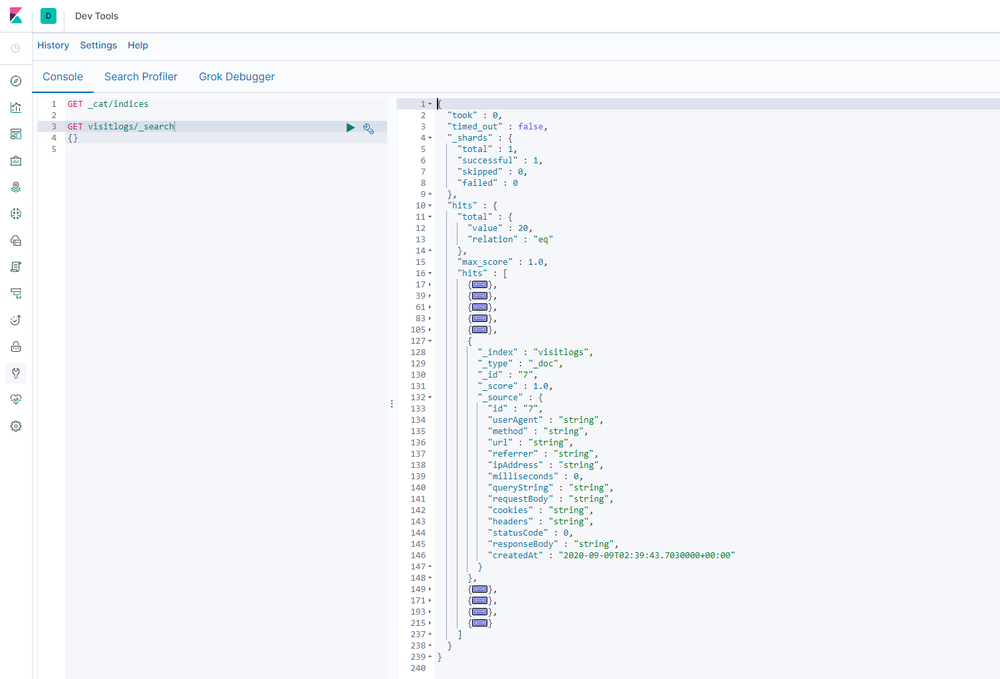

# .NET Core 下使用 ElasticSearch

## 快速入门

参考：[Elasticsearch 快速入门](../storage/elasticsearch/README.md)

## 安装

- [docker下安装Elasticsearch](../docker/repo/elasticsearch.md)
- [其它平台](https://www.elastic.co/cn/downloads/)

## 接入使用

新建一个webapi项目，然后安装两个组件。

```PowerShell
Install-Package NEST
Install-Package Swashbuckle.AspNetCore
```

通过`NEST`来实现操作Elasticsearch，开源地址：<https://github.com/elastic/elasticsearch-net>，同时将swagger也添加以下方便后面调用接口。

接下来演示一个对Elasticsearch的增删改查操作。

添加实体类：`VisitLog.cs`。

```csharp
using System;

namespace ESDemo.Domain
{
    public class VisitLog
    {
        public string Id { get; set; }

        /// <summary>
        /// UserAgent
        /// </summary>
        public string UserAgent { get; set; }

        /// <summary>
        /// Method
        /// </summary>
        public string Method { get; set; }

        /// <summary>
        /// Url
        /// </summary>
        public string Url { get; set; }

        /// <summary>
        /// Referrer
        /// </summary>
        public string Referrer { get; set; }

        /// <summary>
        /// IpAddress
        /// </summary>
        public string IpAddress { get; set; }

        /// <summary>
        /// Milliseconds
        /// </summary>
        public int Milliseconds { get; set; }

        /// <summary>
        /// QueryString
        /// </summary>
        public string QueryString { get; set; }

        /// <summary>
        /// Request Body
        /// </summary>
        public string RequestBody { get; set; }

        /// <summary>
        /// Cookies
        /// </summary>
        public string Cookies { get; set; }

        /// <summary>
        /// Headers
        /// </summary>
        public string Headers { get; set; }

        /// <summary>
        /// StatusCode
        /// </summary>
        public int StatusCode { get; set; }

        /// <summary>
        /// Response Body
        /// </summary>
        public string ResponseBody { get; set; }

        public DateTimeOffset CreatedAt { get; set; } = DateTimeOffset.UtcNow;
    }
}
```

确定好实体类后，来包装一下Elasticsearch，简单封装一个基类用于仓储的集成使用。

添加一个接口类`IElasticsearchProvider`。

```csharp
using Nest;

namespace ESDemo.Elasticsearch
{
    public interface IElasticsearchProvider
    {
        IElasticClient GetClient();
    }
}
```

在`ElasticsearchProvider`中实现`IElasticsearchProvider`接口。

```csharp
using Nest;
using System;

namespace ESDemo.Elasticsearch
{
    public class ElasticsearchProvider : IElasticsearchProvider
    {
        public IElasticClient GetClient()
        {
            var connectionSettings = new ConnectionSettings(new Uri("http://localhost:9200"));

            return new ElasticClient(connectionSettings);
        }
    }
}
```

添加Elasticsearch仓储基类，`ElasticsearchRepositoryBase`。

```csharp
using Nest;

namespace ESDemo.Elasticsearch
{
    public abstract class ElasticsearchRepositoryBase
    {
        private readonly IElasticsearchProvider _elasticsearchProvider;

        public ElasticsearchRepositoryBase(IElasticsearchProvider elasticsearchProvider)
        {
            _elasticsearchProvider = elasticsearchProvider;
        }

        protected IElasticClient Client => _elasticsearchProvider.GetClient();

        protected abstract string IndexName { get; }
    }
}
```

也就是一个抽象类，当我们集成此基类的时候需要重写`protected abstract string IndexName { get; }`，指定IndexName。

完成上面简单封装，现在新建一个`IVisitLogRepository`仓储接口，里面添加四个方法：

```csharp
using ESDemo.Domain;
using System;
using System.Collections.Generic;
using System.Threading.Tasks;

namespace ESDemo.Repositories
{
    public interface IVisitLogRepository
    {
        Task InsertAsync(VisitLog visitLog);

        Task DeleteAsync(string id);

        Task UpdateAsync(VisitLog visitLog);

        Task<Tuple<int, IList<VisitLog>>> QueryAsync(int page, int limit);
    }
}
```

所以接下来不用说你也知道改干嘛，实现这个仓储接口，添加`VisitLogRepository`，代码如下：

```csharp
using ESDemo.Domain;
using ESDemo.Elasticsearch;
using System;
using System.Collections.Generic;
using System.Linq;
using System.Threading.Tasks;

namespace ESDemo.Repositories
{
    public class VisitLogRepository : ElasticsearchRepositoryBase, IVisitLogRepository
    {
        public VisitLogRepository(IElasticsearchProvider elasticsearchProvider) : base(elasticsearchProvider)
        {
        }

        protected override string IndexName => "visitlogs";

        public async Task InsertAsync(VisitLog visitLog)
        {
            await Client.IndexAsync(visitLog, x => x.Index(IndexName));
        }

        public async Task DeleteAsync(string id)
        {
            await Client.DeleteAsync<VisitLog>(id, x => x.Index(IndexName));
        }

        public async Task UpdateAsync(VisitLog visitLog)
        {
            await Client.UpdateAsync<VisitLog>(visitLog.Id, x => x.Index(IndexName).Doc(visitLog));
        }

        public async Task<Tuple<int, IList<VisitLog>>> QueryAsync(int page, int limit)
        {
            var query = await Client.SearchAsync<VisitLog>(x => x.Index(IndexName)
                                    .From((page - 1) * limit)
                                    .Size(limit)
                                    .Sort(x => x.Descending(v => v.CreatedAt)));
            return new Tuple<int, IList<VisitLog>>(Convert.ToInt32(query.Total), query.Documents.ToList());
        }
    }
}
```

现在去写接口，添加一个`VisitLogController`API控制器，代码如下：

```csharp
using ESDemo.Domain;
using ESDemo.Repositories;
using Microsoft.AspNetCore.Mvc;
using System.ComponentModel.DataAnnotations;
using System.Threading.Tasks;

namespace ESDemo.Controllers
{
    [Route("api/[controller]")]
    [ApiController]
    public class VisitLogController : ControllerBase
    {
        private readonly IVisitLogRepository _visitLogRepository;

        public VisitLogController(IVisitLogRepository visitLogRepository)
        {
            _visitLogRepository = visitLogRepository;
        }

        [HttpGet]
        public async Task<IActionResult> QueryAsync(int page = 1, int limit = 10)
        {
            var result = await _visitLogRepository.QueryAsync(page, limit);

            return Ok(new
            {
                total = result.Item1,
                items = result.Item2
            });
        }

        [HttpPost]
        public async Task<IActionResult> InsertAsync([FromBody] VisitLog visitLog)
        {
            await _visitLogRepository.InsertAsync(visitLog);

            return Ok("新增成功");
        }

        [HttpDelete]
        public async Task<IActionResult> DeleteAsync([Required] string id)
        {
            await _visitLogRepository.DeleteAsync(id);

            return Ok("删除成功");
        }

        [HttpPut]
        public async Task<IActionResult> UpdateAsync([FromBody] VisitLog visitLog)
        {
            await _visitLogRepository.UpdateAsync(visitLog);

            return Ok("修改成功");
        }
    }
}
```

大功告成，最后一步不要忘记在`Startup.cs`中添加服务，不然无法使用依赖注入。

```csharp
...
services.AddSingleton<IElasticsearchProvider, ElasticsearchProvider>();
services.AddSingleton<IVisitLogRepository, VisitLogRepository>();
...
```

一切准备就绪，现在满怀期待的运行项目，打开swagger界面。


按照新增、更新、删除、查询的顺序依次调用接口。新增可以多来几次，因为默认是没有数据的，多添加一点可以测试分页是否ok，这里就不再演示了。

如果你有安装kibana，现在可以满怀惊喜的去查看一下刚才添加的数据。

```bash
GET _cat/indices

GET visitlogs/_search
{}
```



可以看到，数据已经安安静静的躺在这里了。

本篇简单介绍Elasticsearch在.NET Core中的使用，关于检索数据还有很多语法没有体现出来，如果在开发中需要用到，可以参考官方的各种数据查询示例：<https://github.com/elastic/elasticsearch-net/tree/master/examples>
