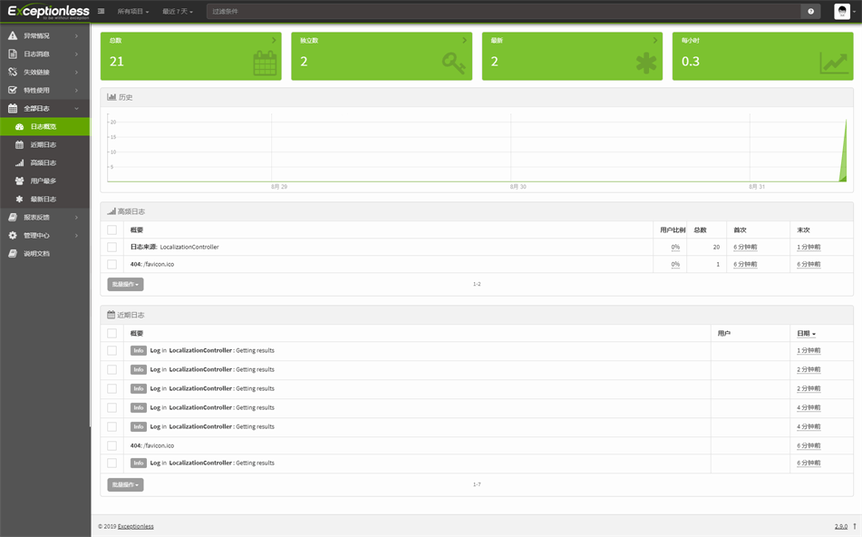

# .NET Core 下使用 Exceptionless 记录日志

`ExceptionLess`是一套免费开源分布式系统日志收集框架，也是我无意中发现的，支持自己部署和平台托管的方式接入使用。

- `ExceptionLess`官网：<https://exceptionless.com>
- `ExceptionLess`开源地址：<https://github.com/exceptionless/Exceptionless>
- `ExceptionLess`.NET客户端开源地址：<https://github.com/exceptionless/Exceptionless.Net>

## 安装

如果是自己小项目，可以直接使用托管的方式接入`ExceptionLess`，但是如果是公司项目还是建议自己部署吧。

```powershell
docker run --rm -it -p 5000:80 exceptionless/exceptionless:6.1.0
```

成功后，打开：<http://localhost:5000>，可以看到`dashboard`界面，注册账号登录，创建一个项目。


可以看到选择不同的项目类型，配置方法也写的非常清楚，在 .NET Core 照着配置即可。

更多安装方式参考：<https://github.com/exceptionless/Exceptionless/wiki/Self-Hosting>

## 使用

安装 NuGet 程序包到项目中：

```powershell
Install-Package Exceptionless.AspNetCore
```

在`dashboard`界面可以得到一个api密钥，和`dashboard`服务地址，可以放在配置文件中。

```json
{
    "Exceptionless": {
        "ServerUrl": "http://localhost:5000",
        "ApiKey": "pz2zGzIxbAWjHVU4FqR2UV7ATDfYxbpFZXGjQmCR"
    }
}
```

```csharp
public void Configure(IApplicationBuilder app, IWebHostEnvironment env)
    ...
    app.UseExceptionless(Configuration);
    ...
}
```

`UseExceptionless`有多个重载方法，根据需要选择，这里将`IConfiguration`对象传进去，获取`Exceptionless`配置的服务地址和api密钥。

然后在项目中随意写几个接口并访问，在`dashboard`界面就可以实时看到访问日志了，还是挺方便的。



现在您的项目可以自动将所有未处理异常发送到`Exceptionless`了，也可以通过 `ex.ToExceptionless().Submit()`向`Exceptionless`发送已处理的异常。

更多使用方法请参考：<https://github.com/exceptionless/Exceptionless.Net/wiki>
