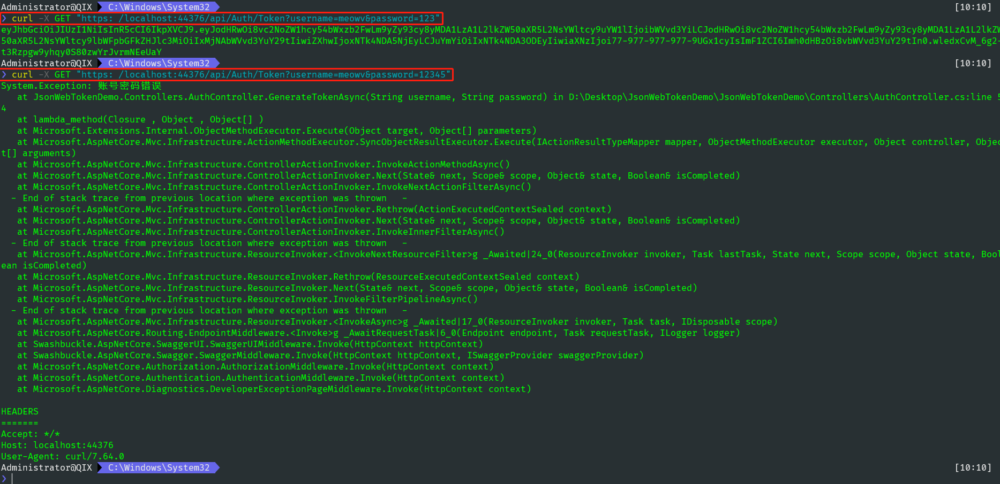
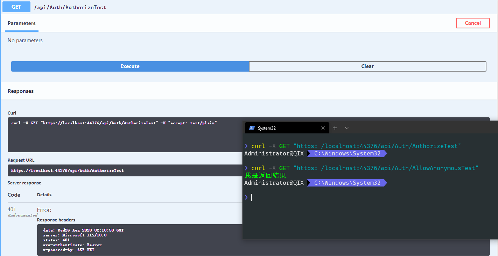

# .NET Core 集成JWT认证

`JWT(Json web token)`就不用过多的介绍了，在 .NET Core 开发中使用JWT进行认证也是比较常见的，而且接入过程也比较简单，随便配置配置就好了。

要想使用JWT，仅仅只需要在项目中引用微软的一个认证组件。

```PowerShell
Install-Package Microsoft.AspNetCore.Authentication.JwtBearer
```

然后将一些敏感数据可以放在配置文件`appsettings.json`中。

```json
{
    "JWT": {
        "ClockSkew": 10,
        "ValidAudience": "https://meowv.com",
        "ValidIssuer": "阿星Plus",
        "IssuerSigningKey": "6Zi/5pifUGx1c+mYv+aYn1BsdXPpmL/mmJ9QbHVz6Zi/5pifUGx1c+mYv+aYn1BsdXPpmL/mmJ9QbHVz6Zi/5pifUGx1c+mYv+aYn1BsdXPpmL/mmJ9QbHVz6Zi/5pifUGx1cw==",
        "Expires": 30
    }
}
```

在`Startup`中添加配置并且使用

```csharp
services.AddAuthentication(JwtBearerDefaults.AuthenticationScheme)
        .AddJwtBearer(options =>
        {
            options.TokenValidationParameters = new TokenValidationParameters
            {
                ValidateIssuer = true,
                ValidateAudience = true,
                ValidateLifetime = true,
                ClockSkew = TimeSpan.FromSeconds(Convert.ToInt32(Configuration.GetSection("JWT")["ClockSkew"])),
                ValidateIssuerSigningKey = true,
                ValidAudience = Configuration.GetSection("JWT")["ValidAudience"],
                ValidIssuer = Configuration.GetSection("JWT")["ValidIssuer"],
                IssuerSigningKey = new SymmetricSecurityKey(Encoding.UTF8.GetBytes(Configuration.GetSection("JWT")["IssuerSigningKey"]))
            };
        });

services.AddAuthorization();
```

```csharp
app.UseAuthentication();
app.UseAuthorization();
```

这样一个简单的JWT配置就完成了，接下来新写一个接口去生成token。

```csharp
using Microsoft.AspNetCore.Authorization;
using Microsoft.AspNetCore.Mvc;
using Microsoft.Extensions.Configuration;
using Microsoft.IdentityModel.Tokens;
using System;
using System.IdentityModel.Tokens.Jwt;
using System.Security.Claims;
using System.Text;

namespace JsonWebTokenDemo.Controllers
{
    [Route("api/[controller]")]
    [ApiController]
    public class AuthController : ControllerBase
    {
        public AuthController(IConfiguration configuration)
        {
            Configuration = configuration;
        }

        public IConfiguration Configuration { get; }

        [HttpGet]
        [Route("Token")]
        public string GenerateTokenAsync(string username, string password)
        {
            if (username == "meowv" && password == "123")
            {
                var claims = new[] {
                    new Claim(ClaimTypes.Name, username),
                    new Claim(ClaimTypes.Email, "123@meowv.com"),
                    new Claim(JwtRegisteredClaimNames.Exp, $"{new DateTimeOffset(DateTime.Now.AddMinutes(Convert.ToInt32(Configuration.GetSection("JWT")["Expires"]))).ToUnixTimeSeconds()}"),
                    new Claim(JwtRegisteredClaimNames.Nbf, $"{new DateTimeOffset(DateTime.Now).ToUnixTimeSeconds()}")
                };

                var key = new SymmetricSecurityKey(Encoding.UTF8.GetBytes(Configuration.GetSection("JWT")["IssuerSigningKey"]));
                var creds = new SigningCredentials(key, SecurityAlgorithms.HmacSha256);

                var securityToken = new JwtSecurityToken(
                    issuer: Configuration.GetSection("JWT")["ValidIssuer"],
                    audience: Configuration.GetSection("JWT")["ValidAudience"],
                    claims: claims,
                    expires: DateTime.Now.AddMinutes(Convert.ToInt32(Configuration.GetSection("JWT")["Expires"])),
                    signingCredentials: creds);

                var token = new JwtSecurityTokenHandler().WriteToken(securityToken);

                return token;
            }
            else
            {
                throw new Exception("账号密码错误");
            }
        }
    }
}
```

模拟用户登录，成功登录则去生成token，在实际应用中还可以对接第三方登录系统进行认证，调用接口看下效果。



可以看到第一个接口输入正确的账号密码，成功返回了token，第二个接口会抛出一个异常。

接下来去写两个接口，去验证一下token的使用是否正常，写一个需要授权的接口和一个不需要授权的接口。

```csharp
[HttpGet]
[Authorize]
[Route("AuthorizeTest")]
public string AuthorizeTest()
{
    return "我是返回结果";
}

[HttpGet]
[AllowAnonymous]
[Route("AllowAnonymousTest")]
public string AllowAnonymousTest()
{
    return "我是返回结果";
}
```

这两个接口的唯一区别就是，`[Authorize]`、`[AllowAnonymous]`。

添加了 `[Authorize]`特性的表明是需要进行授权才可以访问此接口，而添加了`[AllowAnonymous]`特性则表明不需要授权谁都可以访问，同样调用看一下效果。




第一个接口没有返回出结果，可见生效了，此时调用的时候就需要带上我们前面生成的token成功授权后才能返回数据。

有时候当我们没有成功授权，会直接返回一个401的错误页面，如果需要自定义返回信息需要怎么做呢？

这个有好几种做法，可以用中间件，拦截器等等，不过这里推荐一种组件集成好的做法，直接上代码。

```csharp
services.AddAuthentication(JwtBearerDefaults.AuthenticationScheme)
        .AddJwtBearer(options =>
        {
            ...

            options.Events = new JwtBearerEvents
            {
                OnChallenge = async context =>
                {
                    context.HandleResponse();

                    context.Response.ContentType = "application/json;charset=utf-8";
                    context.Response.StatusCode = StatusCodes.Status401Unauthorized;

                    await context.Response.WriteAsync("{\"message\":\"Unauthorized\",\"success\":false}");
                }
            };
        });
```

添加上面这段代码即可，`await context.Response.WriteAsync()`可以返回你自定义的错误消息，这里返回的是一个json字符串。

另外还有一种场景，默认我们拿到token进行授权访问，是需要在请求头中添加`Authorization Bearer {token}`这种方式的，如果我不想在请求头中使用要怎么做呢？比如我想将token放在URL参数中，或者cookie中？

同样也是可以的，而且实现方式也超级简单，看下面代码。

```csharp
services.AddAuthentication(JwtBearerDefaults.AuthenticationScheme)
        .AddJwtBearer(options =>
        {
            ...

            options.Events = new JwtBearerEvents
            {
                ...
                OnMessageReceived = async context =>
                {
                    context.Token = context.Request.Query["token"];

                    await Task.CompletedTask;
                }
            };
        });
```

这里演示了将token放在URL请求参数中，其它情况请根据实际开发场景进行修改即可。


