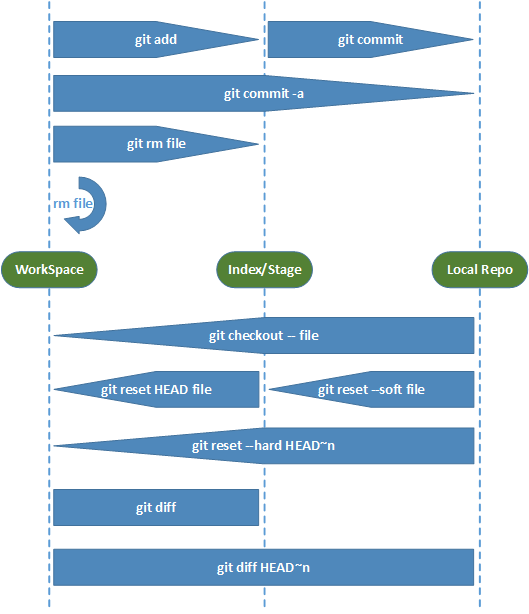

```
git init

#提交
git commit

//git上的分支只是单纯指向某一个提交，和svn比较不一样
#建立分支
git branch <分支名>
#切换到某一个分支
git checkout <分支名>

#合并分支
#第1种方式
git checkout <主分支>
git merge <分支>
#第2种方式
git checkout <分支>
git rebase <主分支>
```


```
git revert head
```

### 4.2.1、创建全新仓库

```
# 在当前目录新建一个Git代码库
$ git init
# 新建一个目录，将其初始化为Git代码库
$ git init [project-name]

# 克隆一个项目和它的整个代码历史(版本信息)
$ git clone [url]
```


```
#查看指定文件状态
git status [filename]

#查看所有文件状态
git status
```

```
# 添加指定文件到暂存区
$ git add [file1] [file2] ...

# 添加指定目录到暂存区，包括子目录
$ git add [dir]

# 添加当前目录的所有文件到暂存区
$ git add 


#直接从暂存区删除文件，工作区则不做出改变
git rm --cached <file>

#如果已经用add 命令把文件加入stage了，就先需要从stage中撤销
git reset HEAD <file>...

#移除所有未跟踪文件
#一般会加上参数-df，-d表示包含目录，-f表示强制清除。
git clean [options] 


#只从stage中删除，保留物理文件
git rm --cached readme.txt 

#不但从stage中删除，同时删除物理文件
git rm readme.txt 

#把a.txt改名为b.txt
git mv a.txt b.txt 
```

```
#用法一
git checkout [-q] [<commit>] [--] <paths>...
#用法二
git checkout [<branch>]
#用法三
git checkout [-m] [[-b]--orphan] <new_branch>] [<start_point>]
```

$ git checkout branch
#检出branch分支。要完成图中的三个步骤，更新HEAD以指向branch分支，以及用branch  指向的树更新暂存区和工作区。

$ git checkout
#汇总显示工作区、暂存区与HEAD的差异。

$ git checkout HEAD
#同上

$ git checkout -- filename
#用暂存区中filename文件来覆盖工作区中的filename文件。相当于取消自上次执行git add filename以来（如果执行过）的本地修改。

$ git checkout branch -- filename
#维持HEAD的指向不变。用branch所指向的提交中filename替换暂存区和工作区中相   应的文件。注意会将暂存区和工作区中的filename文件直接覆盖。

$ git checkout -- . 或写作 git checkout .
#注意git checkout 命令后的参数为一个点（“.”）。这条命令最危险！会取消所有本地的  #修改（相对于暂存区）。相当于用暂存区的所有文件直接覆盖本地文件，不给用户任何确认的机会！

$ git checkout commit_id -- file_name
#如果不加commit_id，那么git checkout -- file_name 表示恢复文件到本地版本库中最新的状态。

